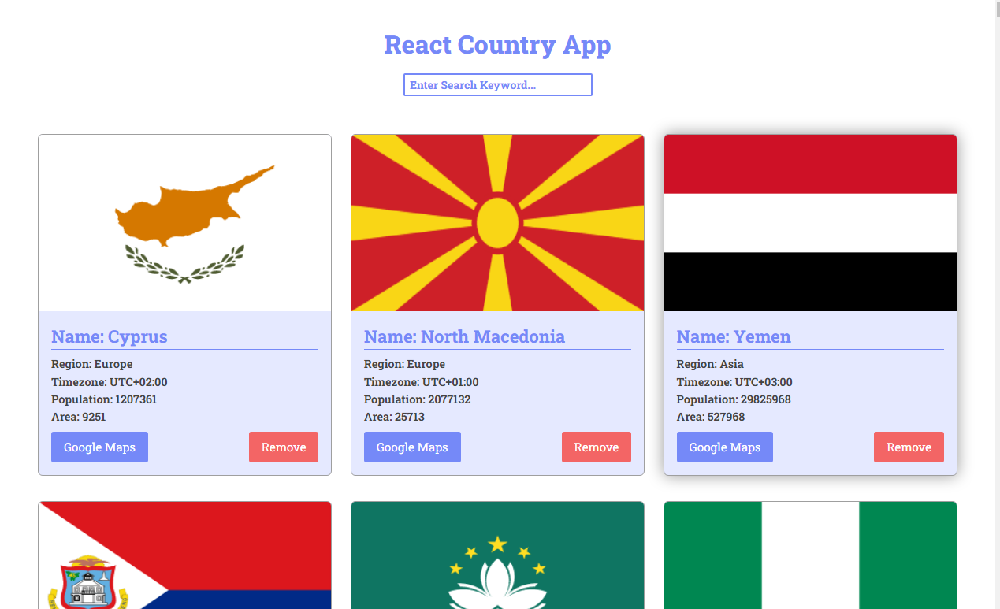

 
<h1 style="text-align:center; border: none;">React Country App</h1>

 

<h3>React Country App | Simple React Api Project</h3>

<h2>Used Language:</h2>
<ul style="list-style: number;">
    <li style="font-weight: bold;">HTML5</li>
    <li style="font-weight: bold;">CSS3</li>
    <li style="font-weight: bold;">Javascript</li>
    <li style="font-weight: bold;">JSX</li>
</ul>

 
<h2>Used Library And Frameworks:</h2>
<ul style="list-style: number;">
    <li style="font-weight: bold;">React Js</li>
    <li style="font-weight: bold;">React uuid</li>
    <li style="font-weight: bold;">Google Maps</li>
</ul>

 
<h2>Included:</h2>
<ul style="list-style: number;">
    <li style="font-weight: bold;">Responsive For All Device</li>
    <li style="font-weight: bold;">W3C Validate Code</li>
    <li style="font-weight: bold;">Modern Javascript ES6</li>
    <li style="font-weight: bold;">100% Fresh Code</li>
    <li style="font-weight: bold;">100% Lag Free</li>
</ul>

 
<a href="https://developer-faras.github.io/sass-landing-page/" style="padding: 10px 20px; background: #fff; text-decoration: none; color: rgb(55, 99, 245);" >Visit Demo</a>

